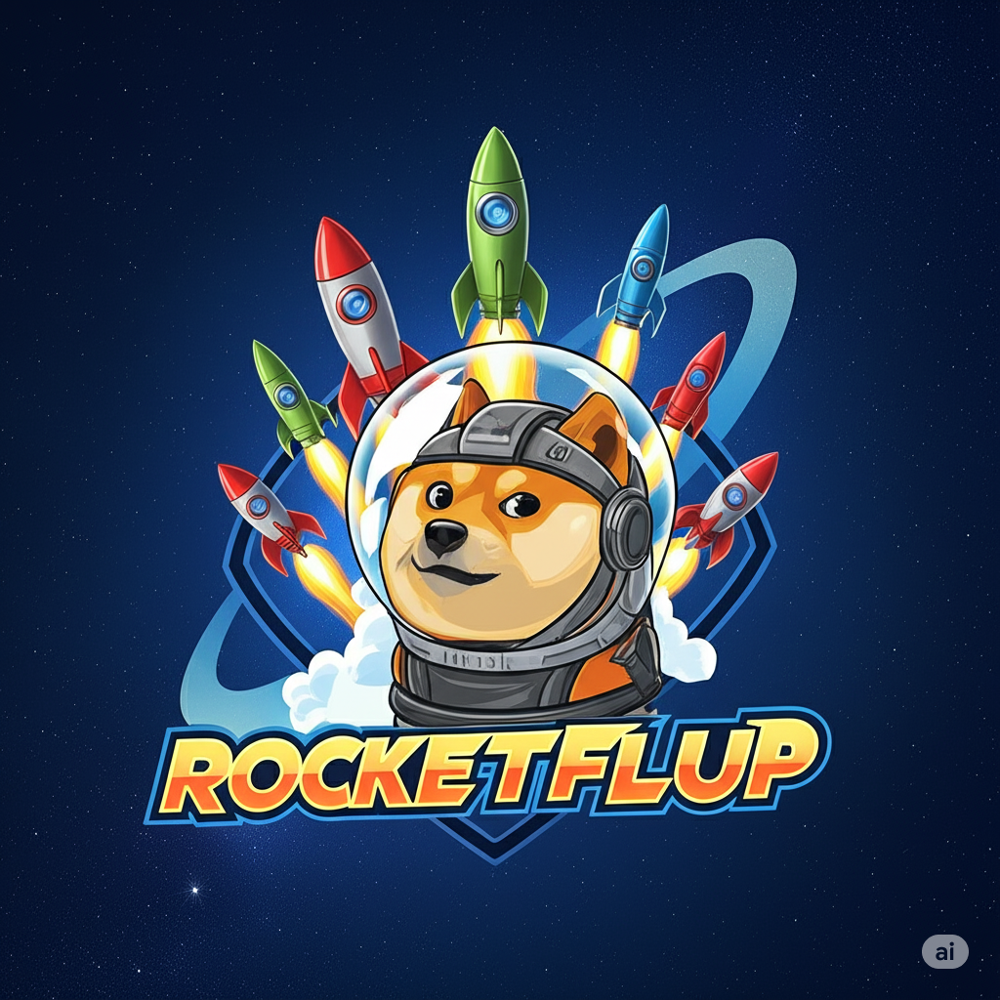

# RocketFlip

## Instructions ###(Windows)

1. **Clone the repositry** to your local machine or open it in Github Codespaces
2. **Navigate to the project directory** in your terminal
3. **Create & activate a virtaul enviroment**
```bash
python -m venv venv
```
```bash
venv/Scripts/activate
```


4.  **Install Pygame** using pip 
```bash
pip install pygame
```

5.   *Run the game** via terminal
```bash
python app.py
```
